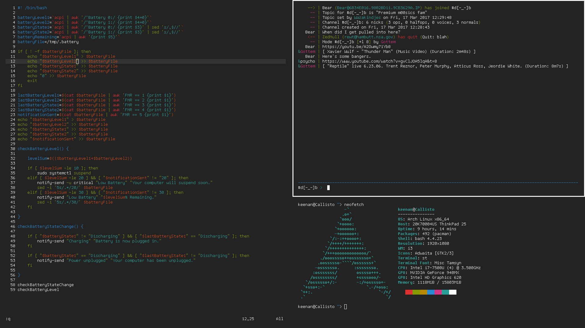
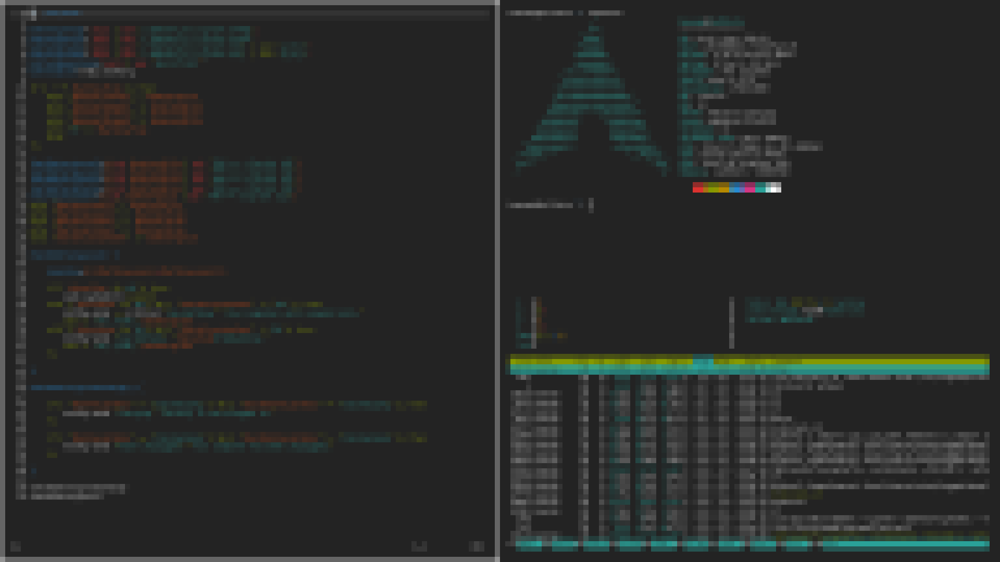

# i3wm

#### Configuration files and scripts for i3wm.

Any dependencies at the top of the file.

* config - Configuration file for i3wm.
* lock.sh - Lock script for i3lock.
* currentbattery.sh - Shows the current battery information through dunst.

#### Screenshots

