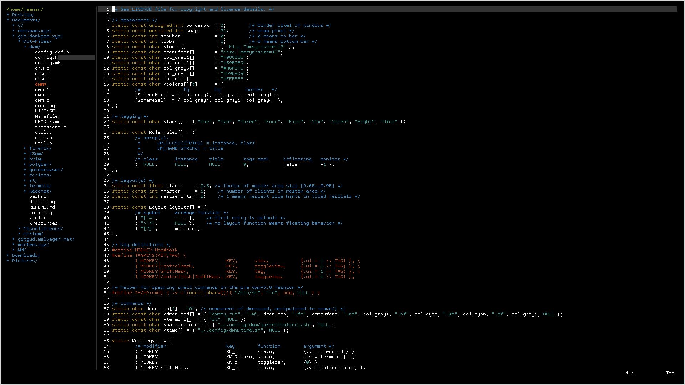

# NeoVim

#### Configuration file and colorscheme for NeoVim.

* init.vim - Configuration file for NeoVim.
* NeoSolarized - Premade Solarized theme for NeoVim with my tweaks.

#### Plugins

* deoplete
* nerdtree
* auto-pairs

#### Screenshots

